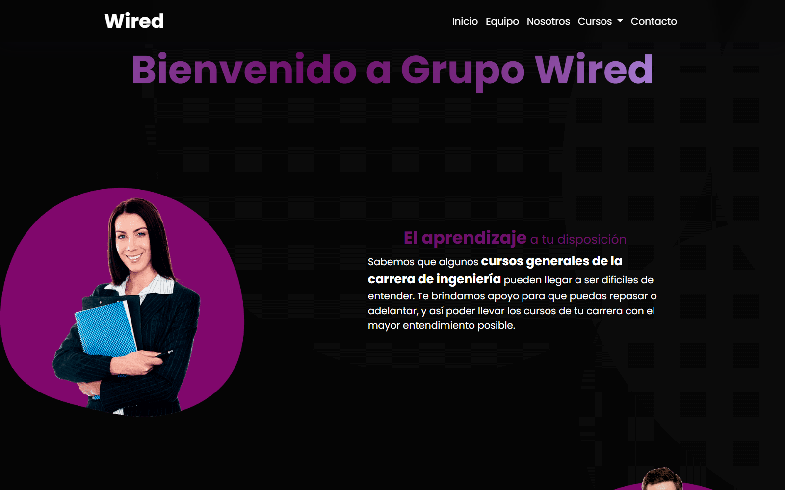
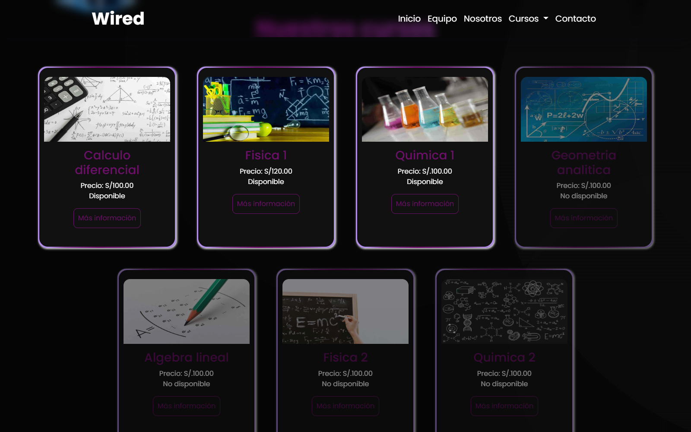
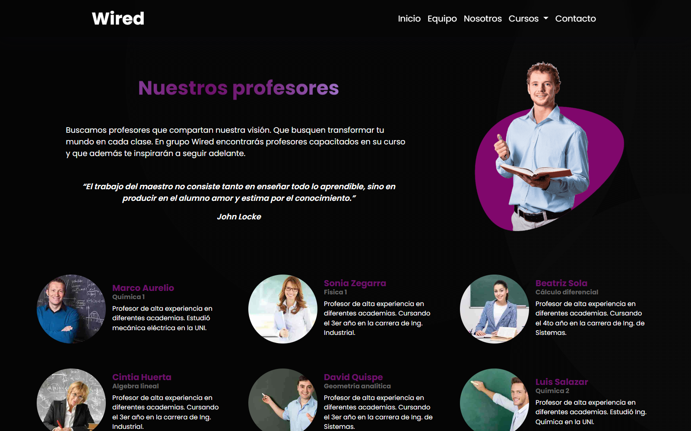

# Grupo Wired

Sitio web informativo para un grupo de estudio universitario enfocado en cursos generales de ingeniería. Presenta la propuesta académica, el catálogo de cursos, el equipo docente y medios de contacto mediante una interfaz responsive.

## Capturas

### Página principal

<p align="center">
  
</p>

### Catálogo de cursos

<p align="center">
  
</p>

### Equipo de profesores

<p align="center">
  
</p>

## Funcionalidades

- Presentación de la propuesta y metodología de Grupo Wired.
- Catálogo visual con cursos disponibles y próximos cursos.
- Páginas independientes para Cálculo Diferencial, Física I y Química I.
- Sección dedicada al equipo de profesores.
- Navegación mediante menú principal y enlaces internos.
- Formulario visual de contacto y enlaces a redes sociales.
- Diseño adaptable para computadoras, tabletas y teléfonos.
- Animaciones y transiciones definidas con Sass.

## Páginas disponibles

| Archivo | Contenido |
| --- | --- |
| `index.html` | Presentación, metodología, cursos y contacto |
| `paginas/equipo.html` | Perfiles del equipo docente |
| `paginas/calculodiferencial.html` | Información del curso de Cálculo Diferencial |
| `paginas/fisicauno.html` | Información del curso de Física I |
| `paginas/quimicauno.html` | Información del curso de Química I |

## Tecnologías

- HTML5 para la estructura semántica.
- Sass para organizar y reutilizar los estilos.
- CSS3 para animaciones, transiciones y diseño visual.
- Bootstrap 5 para componentes y comportamiento responsive.
- Font Awesome para los iconos de navegación y redes sociales.

Bootstrap y Font Awesome se cargan desde CDN, por lo que se necesita conexión a Internet para visualizar todos los estilos e iconos.

## Estructura del proyecto

```text
desarrollo-web-proyecto/
|-- index.html
|-- paginas/
|   |-- calculodiferencial.html
|   |-- equipo.html
|   |-- fisicauno.html
|   `-- quimicauno.html
|-- estilos/
|   |-- style.css
|   `-- style.css.map
|-- sass/
|   |-- _cursos.scss
|   |-- _equipo.scss
|   |-- _footer.scss
|   |-- _general.scss
|   |-- _inicio.scss
|   |-- _keyframes.scss
|   |-- _mediaQueries.scss
|   |-- _navbar.scss
|   `-- style.scss
|-- imagenes/
|-- docs/screenshots/
`-- README.md
```

## Ejecución local

Clona el repositorio:

```bash
git clone https://github.com/AnthonyErazo/desarrollo-web-proyecto.git
cd desarrollo-web-proyecto
```

El proyecto no requiere instalación de dependencias para visualizarse. Se puede abrir `index.html` directamente o iniciar un servidor estático:

```bash
python -m http.server 8000
```

Después abre [http://localhost:8000](http://localhost:8000).

## Compilación de Sass

El CSS compilado ya se encuentra en `estilos/style.css`. Para modificar los archivos fuente se necesita Dart Sass.

Compilación manual:

```bash
sass sass/style.scss estilos/style.css
```

Compilación automática durante el desarrollo:

```bash
sass --watch sass/style.scss:estilos/style.css
```

`style.scss` reúne los parciales según su responsabilidad: estilos generales, navegación, portada, cursos, equipo, pie de página, animaciones y media queries.

## Consideraciones

El formulario de contacto es únicamente demostrativo: no está conectado a un backend ni envía mensajes. Al ser un proyecto completamente estático, puede desplegarse en GitHub Pages, Netlify o cualquier servicio de archivos estáticos.

---

Última actualización del proyecto: **2 de septiembre de 2024**.
